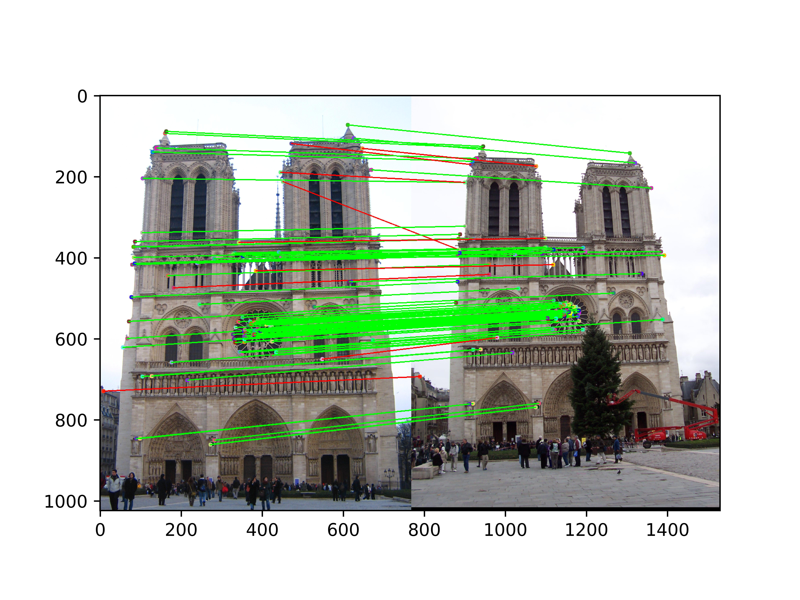
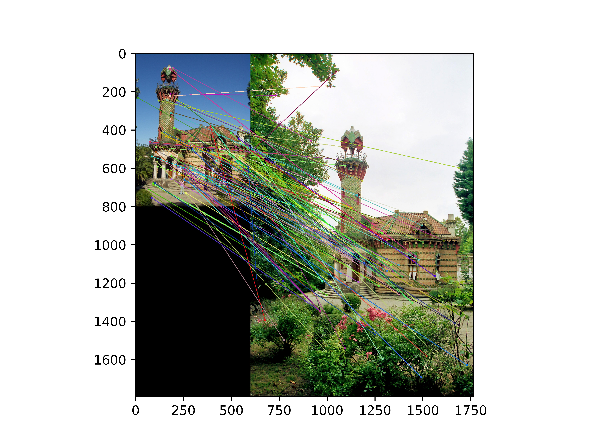
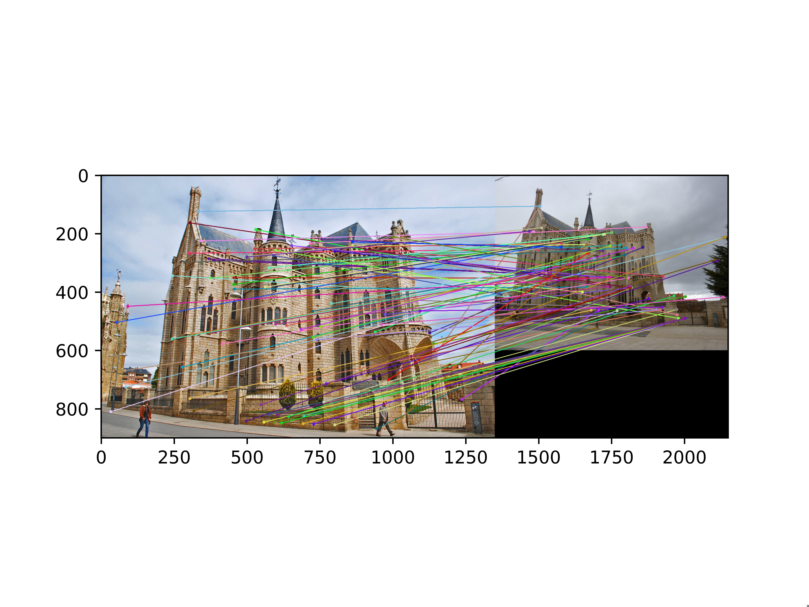
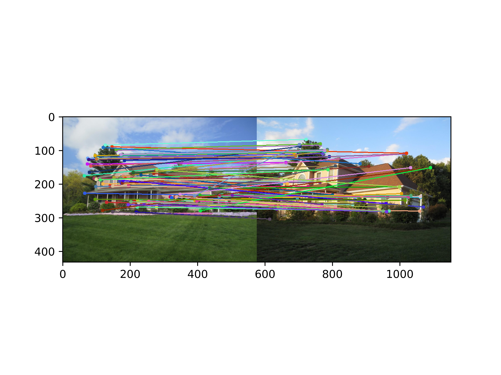
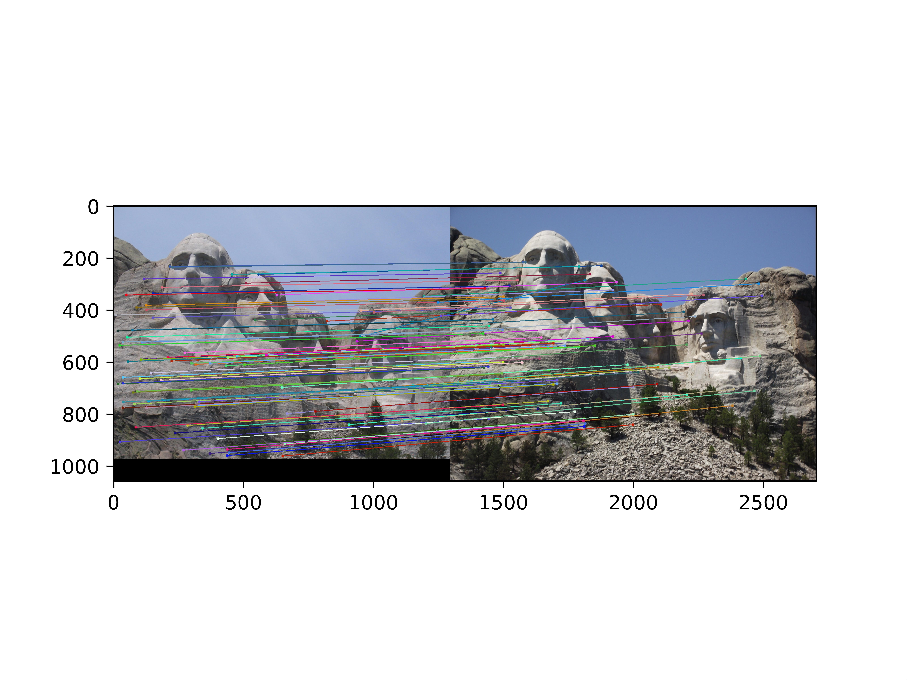
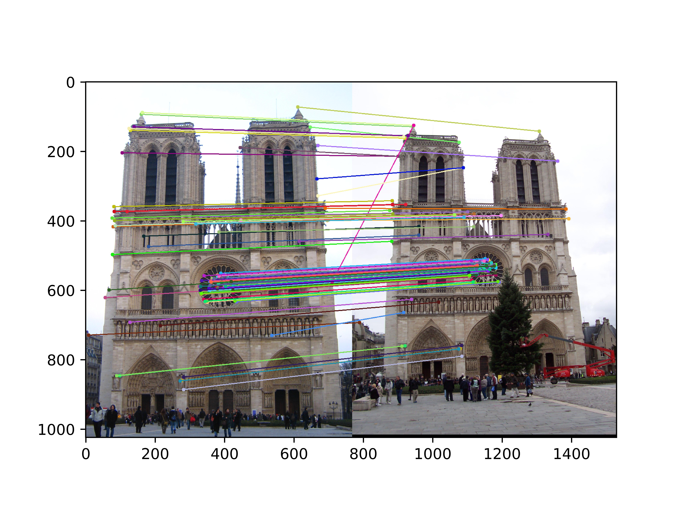
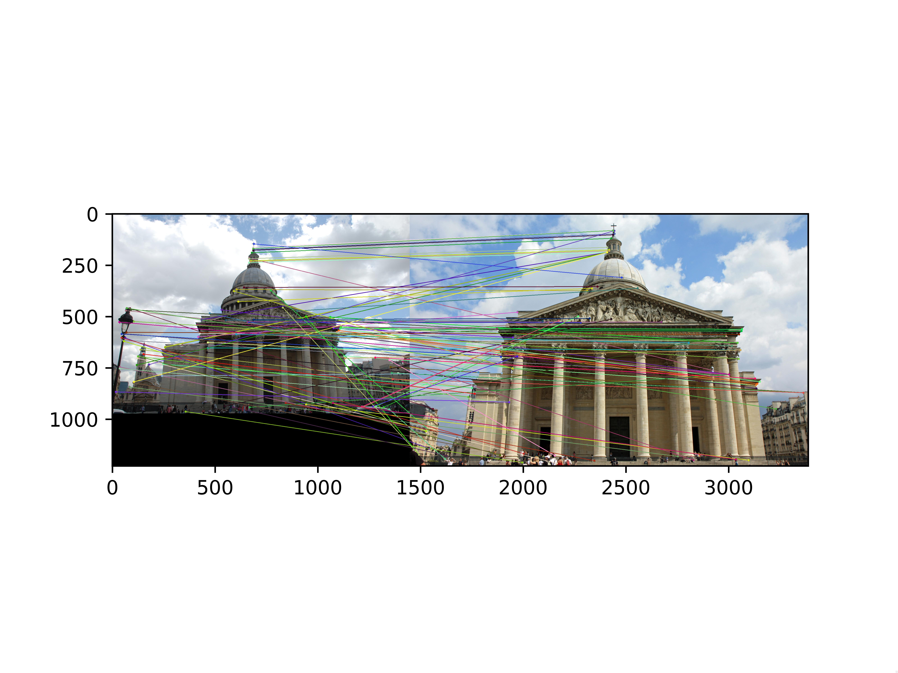
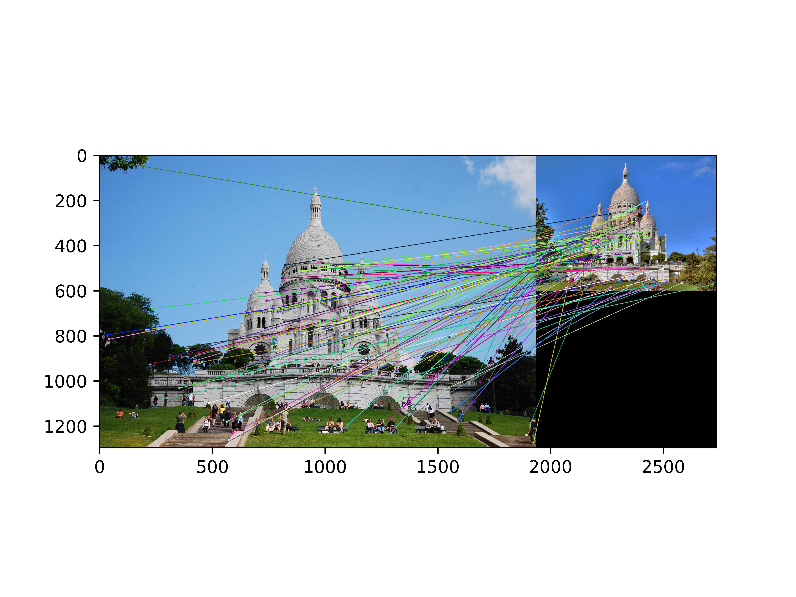
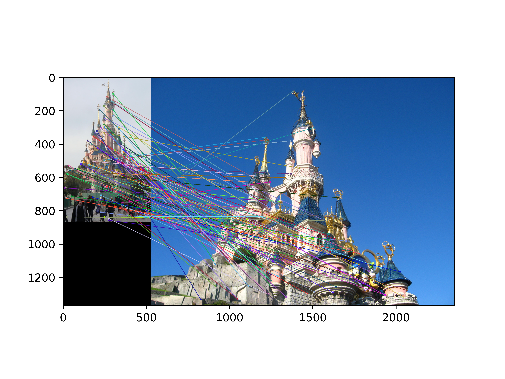
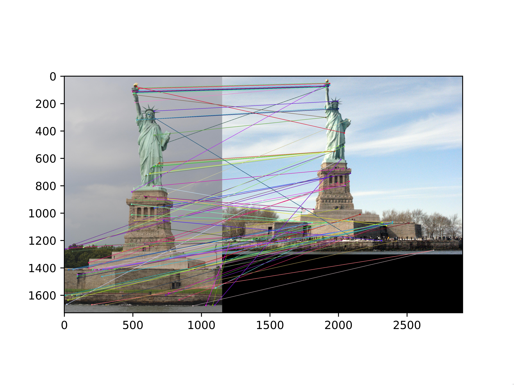

# Local Feature Matching

## Name: Ziheng Wang

## SID: 12310401

## Some important notes

1. In the harris corner detection, the threshold set for the R max is 0.01. If set too high, it will not detect enough corners.
2. In the harris corner detection, the Gaussian filter should be set to 3x3. If set to bigger, like 5x5, it will highly decrease the accuracy of the corner detection.
3. In the feature matching, remember to resort the matches based on the confidence.
4. In the SIFT feature matching, the threshold set for the ratio test is 0.9. Higher threshold will result in more matches, but less accurate. Lower threshold will result in more accurate matches, but the matches will be very few in the hard cases.

Finally, I got **91 percent accuracy** on the Norm Dame.

## Example results of the feature matching

You can find the imges in the results folder.

