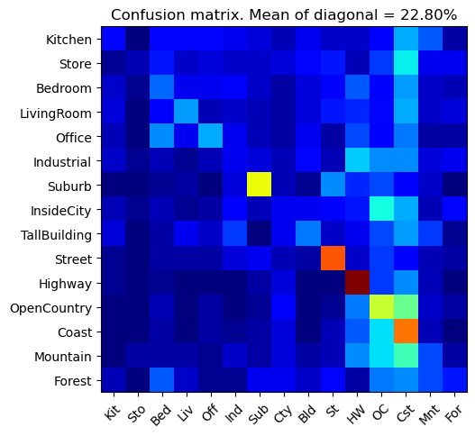
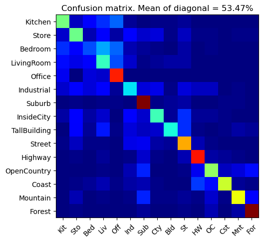
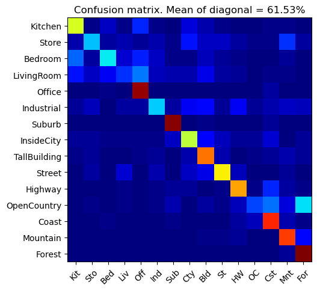

# Computer Vision Assignment Report

Title: Assignment3 

Student Name: Ziheng Wang

Student ID: 12310401


## Experiment 1: The three scene recognition methods

### 1.1 Tiny Image + Nearest Neighbor



### 1.2 Bag of SIFT + Nearest Neighbor

vocab size = 200



### 1.3 Bag of SIFT + Linear SVM

vocab size = 200



## Experiment 2: Differ Vocab Size

|Vocab Size|Bag of SIFT + Nearest Neighbor|Bag of SIFT + Linear SVM|
|:--:|:--:|:--:|
|10|44.07%|38.53%|
|50|50.93%|54.07%|
|100|53.07%|57.33%|
|200|55.40%|59.07%|
|1000|53.53%|65.07%|

## Experiment 3: 1-NN vs K-NN

|K| Tiny Image + Nearest Neighbor | Bag of SIFT + Nearest Neighbor |
|:--:|:--:|:--:|
|1|22.93%|50.93%|
|3|24.00%|65.07%|
|5|23.60%|52.67%|
|7|22.27%|53.20%|

## Fast SIFT Experiment

For the cyvlfeat library, it supports the fast sift algorithm, which is used when using the parameter 'fast' in the sift function. 

```python
frames, descriptors = vlfeat.sift.dsift(img_single, 
                                                step=sift_step_size, 
                                                fast=sift_fast_mode)
```

On vocab size = 10, if not using the fast sift:

- Vocab Build: 145.65s
- Bos feature extraction: 143.88s


If using the fast sift:

- Vocab Build: 18.04s
- Bos feature extraction: 15.16


